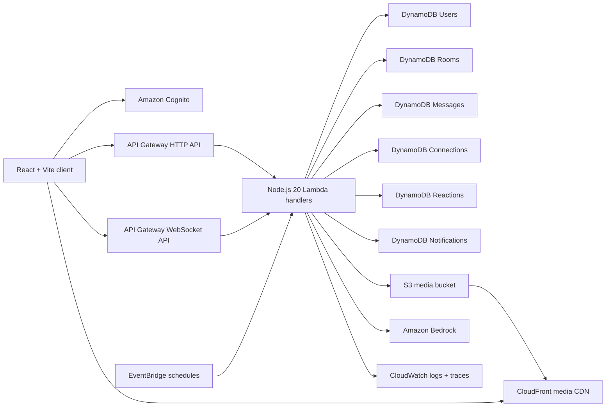

# Architecture

## Data Model

| Table | Partition Key | Sort Key | GSIs |
| --- | --- | --- | --- |
| Users | userId | - | status-updatedAt-index |
| Connections | connectionId | - | roomId-index |
| Rooms | roomId | - | - |
| Messages | messageId | - | roomId-createdAt-index |
| Reactions | reactionId | - | messageId-index |
| Notifications | notificationId | - | userId-createdAt-index |

## Scaling Strategy

DynamoDB is configured on-demand and query paths use bounded room, status, or user indexes. WebSocket fanout reads only active room connections and drops stale connection IDs after API Gateway returns `410 Gone`. Media moves directly from browser to S3 through short-lived presigned URLs, keeping Lambda out of the upload data path. CloudFront serves media globally with an origin access control.

## Security Model

HTTP APIs use a Cognito JWT authorizer and handlers verify bearer tokens before sensitive operations. S3 blocks public access and CloudFront reads through OAC. IAM statements are scoped per function to the tables and actions they need. Password policy, email verification, encrypted S3 objects, CloudWatch logging, and input validation are enabled by default.

